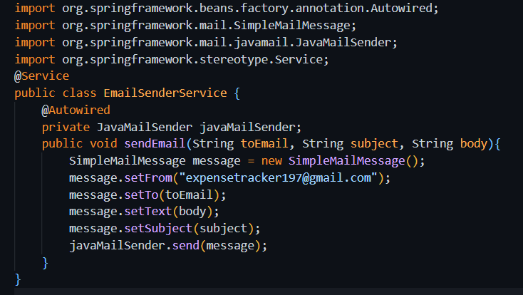
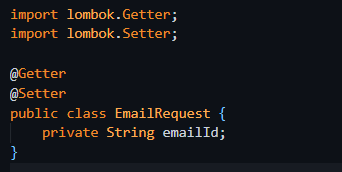
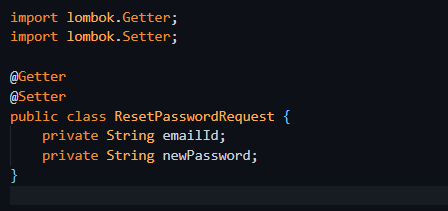
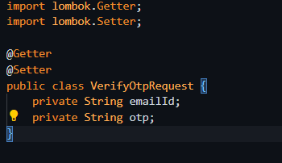

# OTP-Based Email Sender Service

## Overview

This service allows you to generate and send a One-Time Password (OTP) via email using **Spring Boot**. It can be used for user verification, password resets, or any other functionality that requires secure OTP-based authentication. The OTP is sent to the user's email and can be validated within a specific time limit.

## Features

- Generates a random 5-digit OTP.
- Sends OTP to the user's email using Spring Boot's mail functionality.
- Configurable email service properties.
- Verifies OTP within a valid time frame.

## Prerequisites

- Java 8 or higher
- Spring Boot
- An SMTP server or email provider (e.g., Gmail, SendGrid)
- Maven or Gradle for dependencies

## Dependencies
- https://mvnrepository.com/artifact/org.springframework.boot/spring-boot-starter-mail
- https://mvnrepository.com/artifact/io.jsonwebtoken/jjwt-api
- https://mvnrepository.com/artifact/io.jsonwebtoken/jjwt-impl
- https://mvnrepository.com/artifact/io.jsonwebtoken/jjwt-jackson

**Above Dependencies are required to send and verify the otp.**

## Application.Properties setup
- spring.mail.host=smtp.gmail.com
- spring.mail.port=587
- spring.mail.username= your-email-Id.
- spring.mail.password= Generated App-password. 
- spring.mail.properties.mail.smtp.auth=true
- spring.mail.properties.mail.smtp.starttls.enable=true
- spring.mail.properties.mail.smtp.connectiontimeout=5000
- spring.mail.properties.mail.smtp.timeout=25000
- spring.mail.properties.mail.smtp.writetimeout=5000

## Potential Issues and Gmail Setup.
- Try to maximise the smtp.timeout as there is a chance it might give socket timed out error.
- Create a Gmail Account.
- Enable 2 Factor Authentication.
- Search for App Passowords and generate one for your application.
- Replace spring.mail.password with the generated password.

## Email Sender Service Setup.
- Create a class named as EmailSenderService.

- It uses JavaMailSender to send the email from springframework.mail.javamail.JavaMailSender.

## Modified Authentication filter for OTP verification.
- Create a class named as JwtAuthenticationFilter.

- Apart from general Auth filter a special Auth filter for /rest-password specific endpoint is created.
- To perform the OTP verfication filteration.

## Authentication Controller.
- Create a class named as AuthenticationController.
- Implement the controllers for the forgot-password, otp-verification, reset-password routes.

- These routes are used to send the OTP, verify the OTP and reset the password.
- They all return a response entity with the status code and message.
- Dto classes are used to map the request and response objects.

## Dto Classes.
- Three types of Dto are used EmailRequest,ResetPasswordRequest,VerifyOtpRequest.

- Email Request Dto.

     

- Reset Password Request.

    

- Verify Otp Request.

    

## Conclusion
- This service can be used to send OTPs via email for user verification, password resets, or any other functionality that requires secure OTP-based authentication.